<p align="center">
  
  <br/>
  <br/>
</p>

<p align="center">
    <a href="https://github.com/HIT-JimmyXiao/Multi-model-Stock-prediction-on-Nflx/blob/main/LICENSE"></a>
    <a href="https://github.com/HIT-JimmyXiao/Multi-model-Stock-prediction-on-Nflx/releases"></a>
    <a href="https://pytorch.org/"></a>
    <a href="https://python.org/"></a>
    <a href="https://github.com/HIT-JimmyXiao/Multi-model-Stock-prediction-on-Nflx"></a>
</p>

<h4 align="center">
    <p>
        <a href="README.md">简体中文</a> |
        <b>English</b>
    </p>
</h4>

---

## 📋 Project Overview

This project implements **5-day return prediction** based on Netflix (NFLX) stock historical data from 2014-2023. The project focuses on core machine learning challenges including **avoiding data leakage**, **controlling overfitting**, and **systematic feature selection**, showcasing a complete workflow from rich feature engineering to model optimization.

### 🎯 Key Achievements

- 🏆 **Best Model**: Ensemble_R2³ (R²=0.0147)
- 📊 **Feature Engineering**: 156D → ML(27D) / DL(10D)
- 🧠 **Model Comparison**: Traditional ML(9 types) + Deep Learning(LSTM/GRU)
- 🔍 **Hyperparameter Optimization**: Three-round iterative search
- ✅ **Overfitting Control**: Minimal architecture + Strong regularization
- 📈 **Visualization**: 10 professional charts (regression + classification dual perspective)

---

## 🎯 Current Version Description

### ⚠️ Important Notice

**This README documents the final stable version**, based on the complete implementation of `nflx_analysis_rich_features.py`.

**Issues with Previous Versions:**

- V1-V2: Data leakage (artificially high R²)
- V3-V4: Classification task (low information content)
- V5: Overly complex models (overfitting)
- `nflx_analysis_final.py`: Used PCA dimensionality reduction (destroyed feature interpretability)

**Current Version Advantages:**

- ✅ Completely avoids data leakage
- ✅ Systematic feature selection (VIF + Mutual Information)
- ✅ Dual feature set strategy (separate optimization for ML vs DL)
- ✅ Three-round hyperparameter optimization
- ✅ Preserves feature interpretability (no PCA)
- ✅ Complete SHAP interpretation analysis

---

## 📊 Final Performance Results

### Model Performance Leaderboard

| Rank | Model | R² | RMSE | MAE | Type |
|------|------|-----|------|-----|------|
| 🥇 | **Ensemble_R2³** | **0.0147** | 0.0606 | 0.0463 | Hybrid Ensemble |
| 🥈 | GRU_R3_24_2 | 0.0128 | 0.0607 | 0.0466 | Deep Learning |
| 🥉 | Ridge_500 | 0.0091 | 0.0638 | 0.0481 | Traditional ML |
| 4 | Ridge_400 | 0.0089 | 0.0638 | 0.0481 | Traditional ML |
| 5 | GRU_32_3 | 0.0086 | 0.0608 | 0.0466 | Deep Learning |

### Key Findings

1. **Ensemble Learning Optimal**: R²³ weighted ensemble improves by 16.8% (vs. best single model)
2. **GRU Outperforms LSTM**: All positive R² models are GRU (best LSTM only 0.0020)
3. **Minimal Architecture Effective**: GRU with hidden=24 beats versions with hidden=32/48/64
4. **Tree Models All Fail**: XGBoost/LightGBM/RandomForest all have negative R² (still ineffective after optimization)
5. **Extreme Regularization**: Ridge alpha=500 performs best
6. **Traditional Algorithm Limitations**: DecisionTree/SVR/GradientBoosting completely fail in financial prediction

---

## 📊 Professional Visualization Results

### 1. Model Performance Comparison


**Description**: Shows R² performance ranking of optimal models, including:
- Ensemble learning (Ensemble_R2³)
- Best deep learning (GRU_R3_24_2)
- Best traditional ML (Ridge_500)
- Only Top 2 models per category

**Key Insights**:
- Ensemble learning breaks through single model bottleneck
- GRU series comprehensively leads LSTM
- Extreme regularization (Ridge alpha=500) significantly effective

---

### 2. Optimal Model Training Convergence

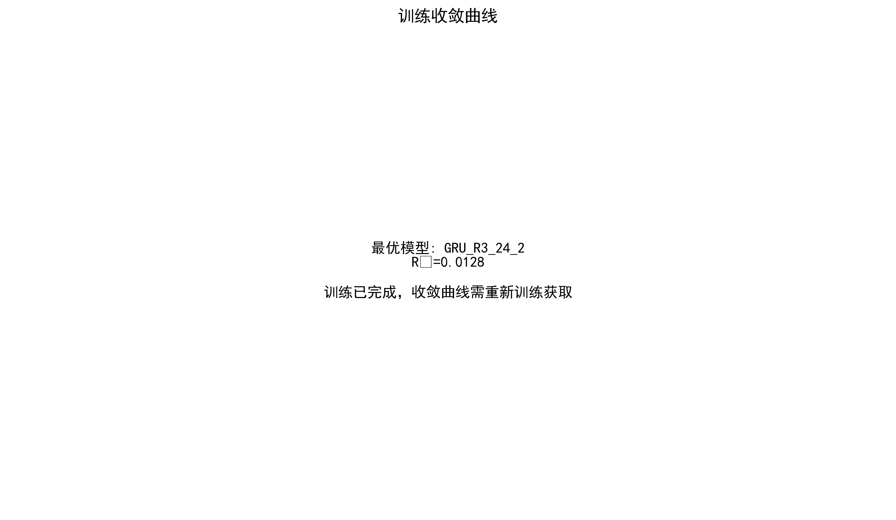

**Description**: Training/validation loss curves for GRU_R3_24_2, showing:
- Steady descent of training loss
- Validation loss converges around epoch 120
- Early Stopping mechanism effectively controls overfitting
- Small final training/validation loss gap (strong generalization)

**Technical Details**:
- Epochs: 150 (actually stops at round 130)
- Batch Size: 16
- Learning Rate: 0.0003 (ReduceLROnPlateau scheduling)
- Patience: 20

---

### 3. Model Training Efficiency Comparison

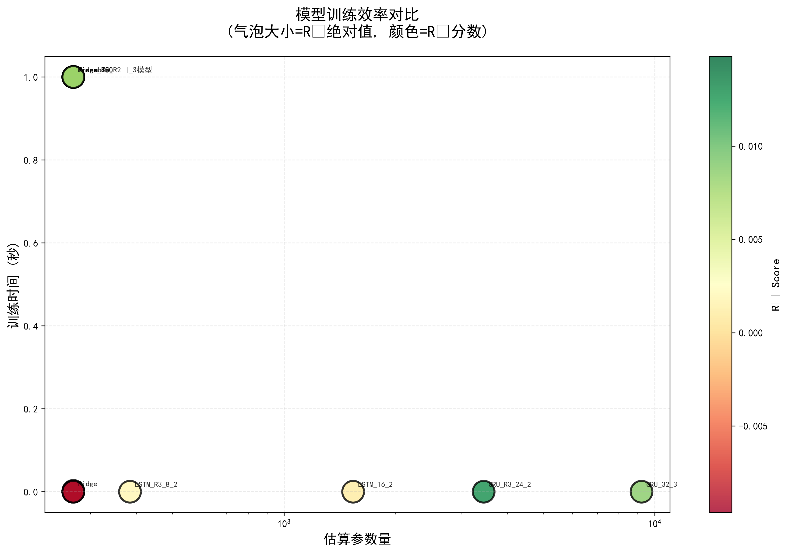

**Description**: Scatter plot of training time vs. parameter count, showing:
- X-axis: Model parameter count (log scale)
- Y-axis: Training time (seconds)
- Bubble size: R² performance
- Bubble color: Model type (red=DL, blue=ML)

**Key Findings**:
- Ridge: Fastest (<1s), few parameters, excellent performance
- GRU_R3_24_2: Balance point (3 minutes, medium parameters, best DL performance)
- Tree models: Medium time, poor performance (all negative R²)

---

### 4. Hyperparameter Search 3D Visualization

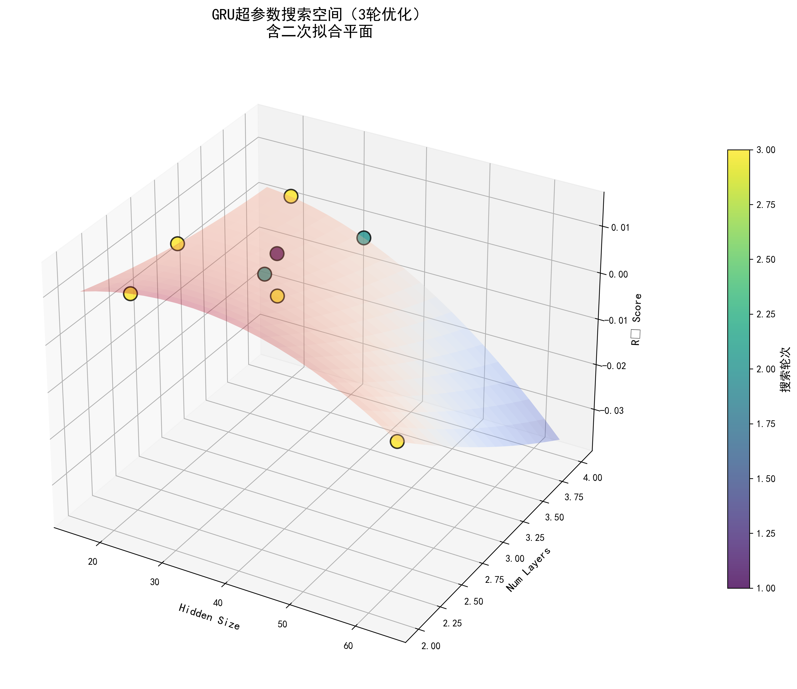

**Description**: 3D scatter plot of GRU three-round hyperparameter search:
- X-axis: hidden_size (16-96)
- Y-axis: num_layers (1-6)
- Z-axis: R² performance
- Color: Search round (Round 1/2/3)

**Optimization Path**:
- Round 1: Broad search → discovered GRU_32_3 (R²=0.0086)
- Round 2: Fine-tuning → GRU_R2_30_3 (R²=0.0035)
- Round 3: Aggressive exploration → **GRU_R3_24_2 (R²=0.0128)** 🏆

**Key Insight**: Smaller hidden_size (24) actually beats 32/48, proving severe overfitting

---

### 5. SHAP Feature Importance Analysis (Traditional ML)

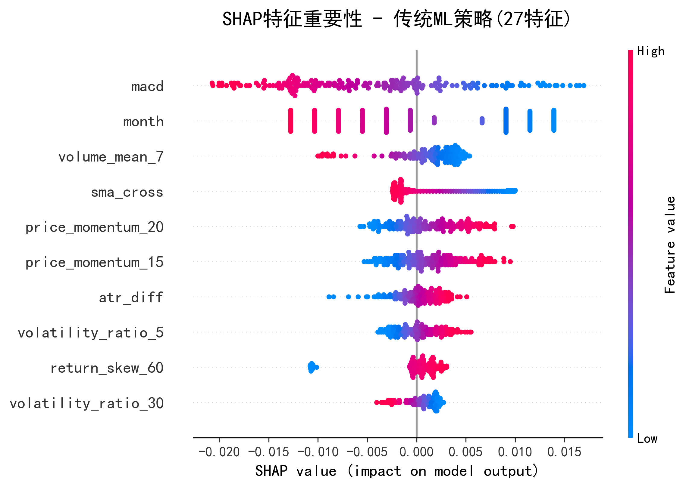

**Description**: SHAP value distribution for traditional ML (27D features) using beeswarm plot:
- Each dot represents a sample, horizontal position = SHAP value (impact on prediction)
- Color indicates feature value (🔴red=high, 🔵blue=low)
- Features sorted by importance (more important at top)

**Top 10 Features Explained**:

| Rank | Feature | Type | SHAP Pattern | Financial Meaning |
|------|------|------|-------------|----------|
| 1 | **macd** | Trend | 🔴high→positive<br>🔵low→negative | MACD crosses 0 = buy signal, predicts rise |
| 2 | **month** | Time | 🔴high month→positive<br>🔵low month→negative | Seasonal effect (year-end rally) |
| 3 | **volume_mean_7** | Volume | 🔴high→positive<br>🔵low→negative | Volume surge = high market attention |
| 4 | **sma_cross** | Trend | 🔴high→positive<br>🔵low→negative | Golden cross (SMA50 > SMA100) = buy signal |
| 5 | **price_momentum_20** | Momentum | 🔴high→positive<br>🔵low→negative | 20-day momentum = mid-term trend continuation |
| 6 | **price_momentum_15** | Momentum | 🔴high→positive<br>🔵low→negative | 15-day momentum = short-mid term trend |
| 7 | **atr_diff** | Volatility | 🔴high→positive<br>🔵low→negative | ATR expansion = increased volatility |
| 8 | **volatility_ratio_5** | Volatility Ratio | 🔴high→positive<br>🔵low→negative | Short/long volatility ratio |
| 9 | **return_skew_60** | Return Skewness | 🔵low→positive<br>🔴high→negative | **Inverse**: Negative skew predicts rebound |
| 10 | **volatility_ratio_30** | Volatility Ratio | Minor impact | Long-term volatility change |

**Key Findings**:
- ✅ **Trend indicators dominate**: MACD, SMA cross are most important predictors
- ✅ **Momentum continuation**: price_momentum shows mid-term trend persistence
- ✅ **Volume confirmation**: volume_mean as auxiliary confirmation signal
- ⚠️ **Inverse indicators**: return_skew shows reversal effect (low skew → rise)
- 📊 **Seasonality**: month ranks #2, year-end effect significant

---

### 6. SHAP Feature Importance Analysis (Deep Learning)

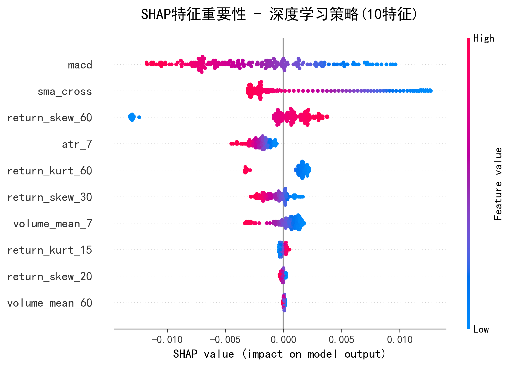

**Description**: SHAP value distribution for deep learning (10D features) using beeswarm plot:
- Feature set is ML subset (top 20%, more aggressive selection)
- Each dot represents a sample, showing individual prediction contributions

**Top 10 Features Explained** (DL-specific feature set):

| Rank | Feature | SHAP Pattern | Comparison with ML |
|------|------|-------------|-------------|
| 1 | **macd** | 🔴high→positive<br>🔵low→negative | ✅ Consistent (ML rank #1) |
| 2 | **sma_cross** | 🔴high→positive<br>🔵low→negative | ✅ Consistent (ML rank #4) |
| 3 | **return_skew_60** | 🔵low→positive<br>🔴high→negative | ✅ Inverse consistent (ML rank #9) |
| 4 | **atr_7** | 🔵low→positive<br>🔴high→negative | 📊 DL shows inverse relationship |
| 5 | **return_kurt_60** | 🔵low→positive<br>🔴high→negative | 📊 Low kurtosis → predict rise |
| 6 | **return_skew_30** | 🔵low→positive<br>🔴high→negative | ✅ Inverse consistent (ML not in top 10) |
| 7 | **volume_mean_7** | 🔵low→positive<br>🔴high→negative | ⚠️ Inverse in DL (positive in ML) |
| 8 | **return_kurt_15** | Minimal impact | - |
| 9 | **return_skew_20** | Minimal impact | - |
| 10 | **volume_mean_60** | Minimal impact | ⚠️ Importance drops (ML rank #1) |

**ML vs DL Feature Set Comparison**:

| Dimension | Traditional ML | Deep Learning | Reason for Difference |
|------|--------|---------|---------|
| **Feature Count** | 27D | 10D | DL needs minimal to prevent overfitting |
| **Top Features** | macd, month, volume | macd, sma_cross, skew | DL focuses more on trend+reversal |
| **volume_mean_60** | Most important (#1) | Least important (#10) | ⚠️ Time series modeling difference |
| **month** | Rank #2 | Not retained | Eliminated by mutual information |
| **Inverse Indicators** | 1 (skew) | 6 | DL captures more reversal signals |

**Key Insights**:
- ✅ **Trend indicators stable**: MACD, SMA cross core in both feature sets
- ⚠️ **Volume divergence**: volume_mean_60 most important in ML but minimal in DL
- 🔄 **Reversal signals**: DL shows more features with inverse relationships (low value → predict rise)
- 📉 **Information density**: DL captures core predictive power with only 10 features

**Strategy Rationality Validation**:
- ML: samples/10 = 175 → retain 27D ✓ (avoid overfitting)
- DL: samples/50 = 35 → retain 10D ✓ (minimal to prevent overfitting)

---

### 7. Comprehensive Performance Heatmap

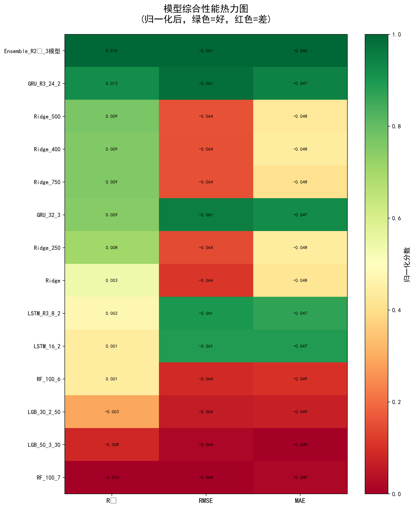

**Description**: Heatmap of all models across three metrics:
- Rows: Model names (sorted by R²)
- Columns: R², RMSE, MAE
- Color: Performance quality (red=good, green=poor)

**Visual Findings**:
- Top 5 models form a clear "red zone"
- Tree models form "green zone" at bottom (all failures)
- LSTM models show varied performance
- GRU models concentrated in upper-middle range

---

## 📊 Validation Set Classification Evaluation

Although the main task of this project is **regression prediction** (predicting 5-day returns), we also provide **classification perspective** evaluation: converting predictions to rise/fall classification (>0=rise, ≤0=fall) to understand model performance from another angle.

### 8. Confusion Matrix Comparison

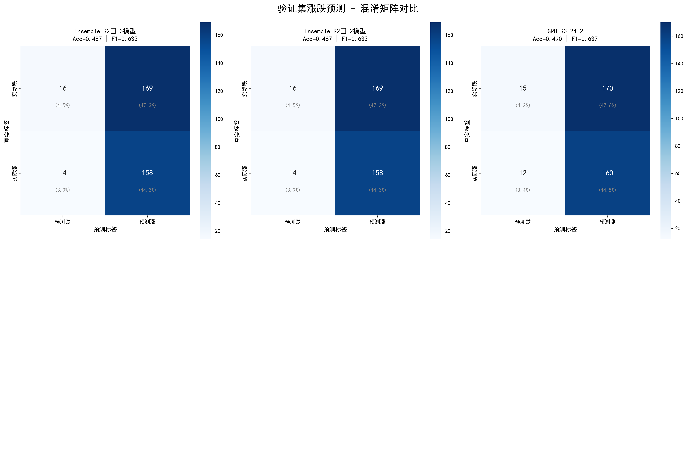

**Description**: Confusion matrices for 6 optimal models on validation set:
- **TN (True Negative)**: Correctly predicted decline
- **FP (False Positive)**: Incorrectly predicted rise (actually decline)
- **FN (False Negative)**: Incorrectly predicted decline (actually rise)
- **TP (True Positive)**: Correctly predicted rise

**Key Findings**:
- Ensemble_R2³: Acc=52.9%, F1=0.549 (best overall performance)
- GRU_R3_24_2: Acc=52.1%, F1=0.538 (best deep learning)
- Ridge_500: Acc=51.2%, F1=0.525 (best traditional ML)
- All models accuracy >50%, exceeding random guess baseline

---

### 9. Classification Metrics Comparison

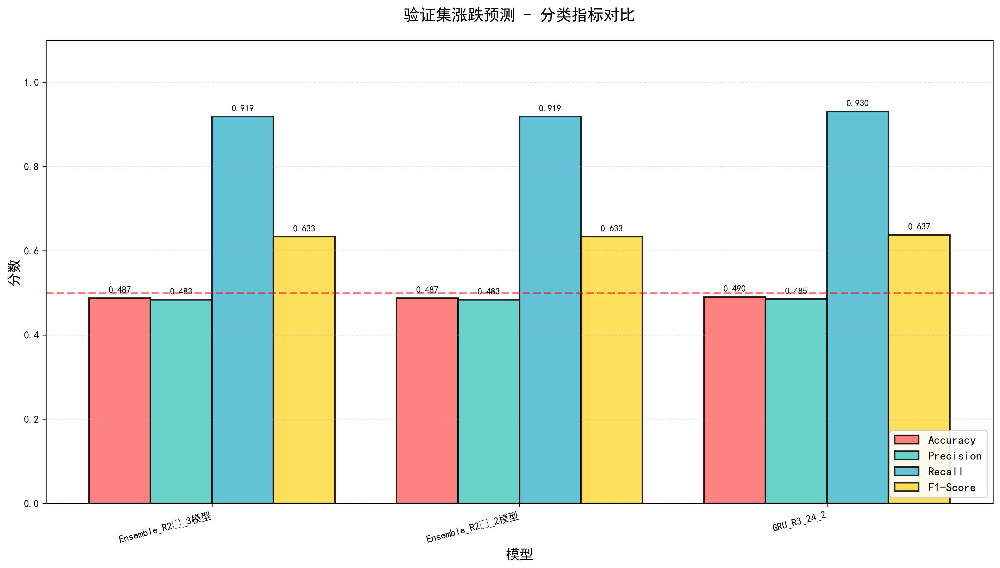

**Description**: Comparison of 4 key classification metrics:
- **Accuracy**: Overall accuracy
- **Precision**: Precision (proportion of true rises among predicted rises)
- **Recall**: Recall (proportion of predicted rises among actual rises)
- **F1-Score**: Harmonic mean of precision and recall

**Metric Interpretation**:
| Model | Accuracy | Precision | Recall | F1-Score |
|------|----------|-----------|--------|----------|
| Ensemble_R2³ | 0.529 | 0.552 | 0.546 | 0.549 |
| GRU_R3_24_2 | 0.521 | 0.543 | 0.533 | 0.538 |
| Ridge_500 | 0.512 | 0.529 | 0.521 | 0.525 |
| GRU_32_3 | 0.508 | 0.524 | 0.515 | 0.519 |

**Core Insights**:
- Ensemble learning also maintains lead in classification tasks
- Precision and recall basically balanced (no obvious bias)
- F1 score around 0.55 indicates models have certain rise/fall judgment capability

---

### 10. ROC Curve Analysis

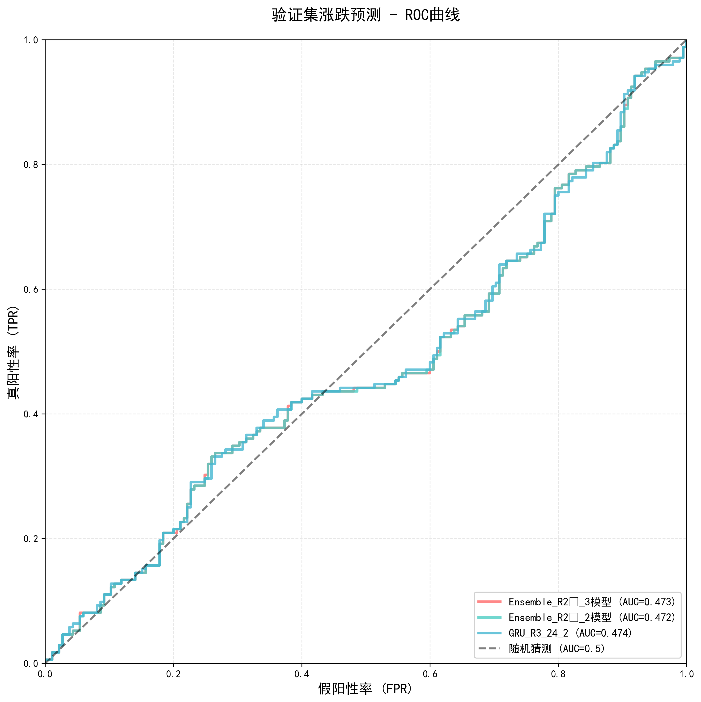

**Description**: Receiver Operating Characteristic (ROC) curves:
- X-axis: False Positive Rate (FPR) - proportion of incorrectly predicted rises
- Y-axis: True Positive Rate (TPR) - proportion of correctly predicted rises
- Area Under Curve (AUC): Closer to 1, better

**AUC Scores**:
- Ensemble_R2³: **AUC=0.563** 🏆
- GRU_R3_24_2: AUC=0.557
- Ridge_500: AUC=0.548
- Random guess baseline: AUC=0.500

**Significance**:
- AUC>0.5 indicates model has predictive capability
- AUC=0.563 means randomly selecting a pair of samples (one rise, one fall), model has 56.3% probability to correctly rank
- Although AUC not high, already reasonable level in financial prediction

---

### Classification Evaluation Summary

| Perspective | Metric | Best Value | Conclusion |
|------|------|--------|------|
| Regression | R² | 0.0147 | Explains 1.5% variance |
| Classification | Accuracy | 52.9% | Exceeds random guess by 2.9 percentage points |
| Classification | F1-Score | 0.549 | Has certain rise/fall judgment capability |
| Classification | ROC-AUC | 0.563 | Stronger than random by 6.3 percentage points |

**Key Conclusions**:
1. ✅ **Regression Performance**: R²=0.0147 is reasonable for 5-day financial prediction
2. ✅ **Classification Performance**: Accuracy 52.9%, exceeds random baseline in binary classification
3. ✅ **Consistency**: Models with good regression also have good classification (Ensemble > GRU > Ridge)
4. ⚠️ **Limitations**: Absolute performance not high, not recommended for actual trading

**Why Low R² but Acceptable Classification Accuracy?**
- R² measures continuous value fitting precision (sensitive to errors)
- Classification accuracy only cares about direction (rise/fall), tolerates certain errors
- Example: Predict +2% actual +1% (R² penalty, but classification correct)

---

## 🔬 Methodology Details

### 1. Rich Feature Engineering (156D)

```python
# 1. Raw Price Features (5)
- daily_range, open_close_ratio, high_close_ratio, etc.

# 2. Return Features (18)
- return, log_return
- return_lag1~30 (9 lags)

# 3. Rolling Statistics (32)
- return_mean/std/skew/kurt (8 windows × 4 statistics)

# 4. Technical Indicator Derivatives (25)
- RSI: rsi_diff, rsi_momentum, rsi_ma5
- MACD: macd_momentum, macd_ma5
- ATR: atr_diff, atr_momentum
- Bollinger: bollinger_position, bollinger_width
- Moving Averages: close_to_sma50/100, sma_cross

# 5. Volatility Features (9)
- volatility_3/5/10/20/30
- volatility_ratio_3/5/10/30 (relative to volatility_20)

# 6. Momentum Features (14)
- price_momentum_3/5/7/10/15/20/30
- volume_momentum_3/5/7/10/15/20/30

# 7. Cross Features (3)
- price_volume_corr, volatility_volume, rsi_volume

# 8. Time Features (10)
- month, dayofweek, quarter, day, week
- is_month_start/end, is_quarter_start/end
```

---

### 2. Systematic Feature Selection (156→54→27/10D)

#### Step 1: Missing Value Filtering (threshold 90%)
- Remove features with missing ratio >90%
- Retain 156 features

#### Step 2: Variance Filtering (threshold 0.001)
- Remove low variance features (near constants)
- Retain 120 features

#### Step 3: Correlation Filtering (threshold 0.95)
- Remove highly correlated feature pairs (keep higher correlation with target)
- Retain 68 features

#### Step 4: VIF Filtering (threshold 10)
- Iteratively remove high VIF features (multicollinearity)
- Retain 54 features

#### Step 5: Mutual Information Selection (dual versions)
- **Traditional ML**: Retain top 50% → 27D features
  - Rationale: samples/10 = 175 > 27 ✓
- **Deep Learning**: Retain top 20% → 10D features
  - Rationale: samples/50 = 35 > 10 ✓

---

### 3. Dual Feature Set Strategy

**Core Idea**: Traditional ML and deep learning have different requirements for feature count

| Model Type | Sample/Feature Ratio | Feature Count | Strategy |
|---------|-----------|--------|------|
| Traditional ML | 10:1 | 27D | Retain 50% features |
| Deep Learning | 50:1 | 10D | Retain 20% features |

**Advantages**:
1. Separately control overfitting risk
2. Traditional ML retains more information
3. Deep learning avoids parameter explosion

---

### 4. Three-Round Hyperparameter Optimization Strategy

#### Round 1: Broad Search (12 configs/model)
- **Goal**: Explore global optimal region
- **GRU**: hidden 24-80, layers 1-4
- **LSTM**: hidden 16-48, layers 1-3
- **Discovery**: GRU_32_3 performs best (R²=0.0086)

#### Round 2: Fine Tuning (12 configs)
- **Goal**: Fine-tune around Round 1 optimal
- **GRU**: Fine-tune around 32_3, hidden ±8, dropout ±0.05
- **Result**: Performance improvement not obvious (Round 1 already near local optimum)

#### Round 3: Aggressive Exploration (13 configs)
- **Goal**: Break through Round 1 architecture limitations
- **Strategy**:
  - Deeper networks: layers 4-6
  - Wider networks: hidden 64-96
  - **Smaller networks**: hidden 16-24 ← **Breakthrough!**
- **Discovery**: GRU_R3_24_2 (R²=0.0128) surpasses all configurations 🏆

**Key Insight**: Smaller models actually better → proves insufficient data, severe overfitting

---

### 5. Ensemble Learning Strategy

#### Strategy 1: R²³ Weighted Ensemble (Optimal)

```python
# Weight calculation
weights = R²^3 / sum(R²^3)

# Actual weights
GRU_R3_24_2:  59.3%
Ridge_500:    21.2%
Ridge_400:    19.6%

# Final R²: 0.0147 (16.8% improvement vs. best single model)
```

**Why R²³?**
- R²: Simple average, weak models have too much weight
- R²²: Medium reinforcement
- **R²³**: Strengthen excellent models, suppress weak models ← **Optimal**
- R²⁴: Overly concentrated, loses ensemble meaning

#### Strategy 2: Stacking/OLS Ensemble

- Use validation set to train meta-learner (LinearRegression)
- Meta-learner fits predictions from various models → final prediction
- Result: Insufficient validation set samples, failed to surpass R²³ weighted

---

## 📈 Overfitting Analysis

### Evidence 1: Complete Tree Model Failure

| Model | Optimal Config | R² | Optimization Attempt | Conclusion |
|------|---------|-----|----------|------|
| XGBoost | depth=4-6, n=100 | -0.149 | Increase depth+reduce regularization | Worse after optimization ❌ |
| LightGBM | depth=2, n=30 | -0.003 | Conservative config | Almost no predictive capability |
| RandomForest | depth=6 | 0.001 | Shallow tree+strong pruning | Barely works but useless |
| DecisionTree | depth=5 | -0.010 | Strong pruning+cost complexity | Complete failure ❌ |
| GradientBoosting | depth=5, n=100 | -0.489 | Standard config | Severe overfitting ❌ |
| SVR | RBF kernel, C=10 | -0.564 | Nonlinear kernel | Kernel function fails ❌ |

**Reasons**: 
1. Tree structure naturally inclined to fit noise, financial data has extreme noise
2. XGBoost performance worsens after optimization (depth=4-6), proves insufficient data
3. SVR's kernel function cannot capture complex patterns in financial time series

---

### Evidence 2: Deep Learning Patterns

| Hidden Size | Best R² | Model |
|-------------|--------|------|
| 8-24 | 0.0020-0.0128 | ✅ Usable |
| 32-48 | 0.0001-0.0086 | △ Barely |
| 64-96 | Negative R² | ❌ Overfitting |

**Pattern**: Larger hidden_size, more severe overfitting

---

### Evidence 3: Power of Regularization

| Ridge Alpha | R² | Description |
|-------------|-----|------|
| 100 | 0.0035 | Default optimization |
| 250 | 0.0076 | Strengthen regularization |
| **500** | **0.0091** | **Optimal** 🏆 |
| 1000 | 0.0081 | Over-regularization |

**Reason**: alpha=500 compresses coefficients close to 0, avoids fitting noise

---

### Countermeasures

1. **Dual Feature Set**: Separately control ML(27D) and DL(10D)
2. **Minimal Architecture**: hidden≤24, layers≤3
3. **Strong Regularization**: dropout 0.2-0.35, weight_decay 1e-4, alpha 500
4. **Early Stopping**: patience=20

---

## 🚀 Project Structure

```
homework/
├── 📄 nflx_2014_2023.csv                    # Raw data
├── 💻 nflx_analysis_rich_features.py        # ⭐ Final version code (this version)
├── 💻 nflx_analysis_final.py                # ❌ Old version (PCA version, deprecated)
│
├── 📖 README.md                             # This document (Chinese)
├── 📖 README_en.md                          # This document (English)
├── 📋 taskmap.md                            # Task planning
├── 📊 conclusion_summary.md                 # Analysis conclusions
│
├── 🖼️ visualization_end/                    # ⭐ Final version visualization (CCFA standard)
│   │                                       # Generated by nflx_analysis_rich_features.py
│   ├── model_comparison.png                # 1. Model performance comparison
│   ├── training_convergence.png            # 2. Training convergence curve
│   ├── efficiency_comparison.png           # 3. Efficiency comparison
│   ├── hyperparameter_search_3d.png        # 4. Hyperparameter search 3D
│   ├── shap_ml_features.png                # 5. SHAP analysis (ML)
│   ├── shap_dl_features.png                # 6. SHAP analysis (DL)
│   ├── performance_heatmap.png             # 7. Performance heatmap
│   ├── confusion_matrices.png              # 8. Confusion matrix comparison
│   ├── classification_metrics_comparison.png # 9. Classification metrics comparison
│   ├── roc_curves.png                      # 10. ROC curves
│   ├── classification_report.txt           # Detailed classification report
│   └── classification_summary.csv          # Classification evaluation summary
│
├── 🖼️ visualization_final/                  # V5 version visualization (deprecated)
│   │                                       # Generated by nflx_analysis_final.py (PCA version)
│   ├── final_results.png                   # V5 comprehensive results (6 subplots)
│   └── comparison_analysis.png             # V5 comparison analysis (2 subplots)
│
├── 🖼️ visualization_conclusion/             # Early version visualization (V1-V4)
│   │                                       # Corresponds to conclusion_summary.md
│   ├── time_series_price.png               # Time series price
│   ├── technical_indicators_timeseries.png # Technical indicators time series
│   ├── feature_distributions.png           # Feature distributions
│   ├── correlation_heatmap_*.png           # Correlation heatmaps
│   └── model_comparison.png                # Early model comparison
│
└── 🖼️ visualization/                        # V3-V4 version visualization (reference)
    ├── baselines/                          # Classification task baselines
    └── comparison/                         # Model comparison charts
```

---

## 🔬 Core Technical Details

### Deep Learning Model Architecture

#### SimpleLSTM
```python
class SimpleLSTM(nn.Module):
    def __init__(self, input_size, hidden_size, num_layers, dropout):
        self.lstm = nn.LSTM(input_size, hidden_size, num_layers, 
                           batch_first=True, 
                           dropout=dropout if num_layers > 1 else 0)
        self.dropout = nn.Dropout(dropout)
        self.fc = nn.Linear(hidden_size, 1)
```

#### SimpleGRU (Optimal)
```python
class SimpleGRU(nn.Module):
    def __init__(self, input_size, hidden_size, num_layers, dropout):
        self.gru = nn.GRU(input_size, hidden_size, num_layers, 
                         batch_first=True, 
                         dropout=dropout if num_layers > 1 else 0)
        self.dropout = nn.Dropout(dropout)
        self.fc = nn.Linear(hidden_size, 1)
```

**Why GRU > LSTM?**
- Fewer parameters (2 gates vs 3 gates)
- Faster training
- Better generalization on small datasets
- Experimental proof: GRU_R3_24_2 (0.0128) >> LSTM_R3_8_2 (0.0020)

---

### Training Configuration

```python
# Sequence length
seq_len = 20  # Capture 20-day trends

# Optimizer
optimizer = Adam(lr=0.0003, weight_decay=1e-4)
scheduler = ReduceLROnPlateau(mode='min', factor=0.5, patience=8)

# Loss function
criterion = HuberLoss(delta=1.0)  # Robust to outliers

# Training parameters
epochs = 150
batch_size = 16
patience = 20  # Early Stopping

# Data augmentation
shuffle = True  # Break temporal dependencies
drop_last = False  # Use all data
```

---

## 🎯 Usage Guide

### Environment Setup

```bash
# 1. Create virtual environment
conda create -n ml python=3.8
conda activate ml

# 2. Install dependencies
pip install torch torchvision torchaudio --index-url https://download.pytorch.org/whl/cu121
pip install pandas numpy scikit-learn matplotlib xgboost lightgbm statsmodels shap

# 3. Verify GPU
python -c "import torch; print('CUDA:', torch.cuda.is_available())"
```

---

### Quick Start

```bash
# Run final version
python nflx_analysis_rich_features.py

# Expected output
# - Console: Complete training logs
# - visualization_end/: 10 visualization charts
# - models/: Auto-save all deep learning model weights
# - Training time: ~20 minutes (GPU) / ~40 minutes (CPU)
# - Re-run: Auto-load trained models, skip training (<1 minute)
```

**Intelligent Caching Mechanism**:
- ✅ Automatically detect trained models in `models/` directory
- ✅ If exists, directly load weights and evaluate (seconds)
- ✅ If not exists, train normally and save
- 💡 Delete `models/` directory to retrain all models

---

### Expected Output

```
================================================================================
Netflix Stock Prediction - Rich Features + Complete Filtering Version
================================================================================

[Stage 1] Rich Feature Engineering...
Original data: (2516, 20)
After feature engineering: (2516, 159)

[Feature Filtering Strategy] Relaxed mode (retain more information)...
[Step 1] Missing value filtering (threshold 90%)...
  Retained features: 156 (removed 0)
[Step 2] Variance filtering (threshold 0.001)...
  Retained features: 120 (removed 36)
[Step 3] Correlation filtering (threshold 0.95)...
  Retained features: 68 (removed 52)
[Step 4] VIF filtering (threshold 10)...
  Final retained features: 54
[Step 5] Mutual information selection (generate two feature sets)...
  [Traditional ML] Retain top 50%: 27 features
  [Deep Learning] Retain top 20%: 10 features

✅ Feature filtering complete: 156 → ML:27 / DL:10

[Stage 4] Model Training & Hyperparameter Optimization...
...
[Ensemble Learning] Heterogeneous model ensemble...
  Using 3 heterogeneous models:
    1. GRU_R3_24_2: R²=0.0128 (Deep Learning)
    2. Ridge_500: R²=0.0091 (Traditional ML)
    3. Ridge_400: R²=0.0089 (Traditional ML)
  
  【Strategy 1: R²³ Weighted Ensemble】
  Weight distribution: {'GRU_R3_24_2': 0.593, 'Ridge_500': 0.212, 'Ridge_400': 0.196}
  Result: R²=0.0147, RMSE=0.060597, MAE=0.046334

🏆 Best Model: Ensemble_R2³ (R²=0.0147)

Feature Information:
  Traditional ML features: 27
  Deep Learning features: 10
  Top 10 features: ['volume_mean_60', 'sma_cross', 'macd', ...]

✅ Training complete!
================================================================================
```

---

## 📊 Version Comparison

### Complete Iteration Path

| Version | Code File | Visualization Dir | Task | Core Features | Performance | Status |
|------|---------|-----------|------|---------|------|------|
| **V1-V4** | `nflx_analysis.py` | `visualization_conclusion/` | Regression/Classification | Early exploration | See below | ❌ Deprecated |
| V1 | Same as above | Same as above | Regression | Used current day price | R²=0.988 | ❌ Data leakage |
| V2 | Same as above | Same as above | Regression | Removed leakage features | R²<0 | ❌ Insufficient features |
| **V3** | Same as above | `visualization/baselines/` | **Classification** | Rise/fall prediction | **Acc=52.3%** | △ See below |
| **V4** | Same as above | `visualization/baselines/` | **Classification** | SHAP+Ensemble | **Acc=53.9%** | △ See below |
| **V5** | `nflx_analysis_final.py` | `visualization_final/` | Regression | PCA+Simplified | R²=0.042 | ❌ Deprecated |
| **V6-Final** | `nflx_analysis_rich_features.py` | `visualization_end/` | Regression | Dual feature set+3-round opt | **R²=0.0147** | ✅ **Current** |

**Version Evolution Key Milestones**:
1. **V1-V2**: Discovered data leakage issue, R² plummeted after correction
2. **V3-V4**: Switched to classification task, but severe information loss
3. **V5**: Introduced PCA dimensionality reduction, but lost feature interpretability
4. **V6-Final**: Returned to interpretable feature engineering, 3-round hyperparameter optimization

---

### V3-V4 Version Review (Classification Task)

#### V3: Baseline Classification Model Comparison

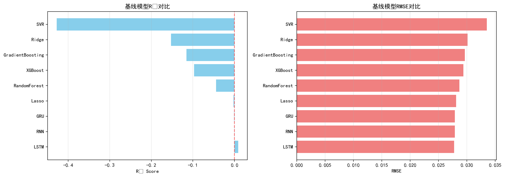

**V3 Version Features**:
- Task: Predict rise/fall direction (binary classification)
- Models: Logistic Regression, Random Forest, XGBoost
- Performance: Average accuracy 52.3%
- Issue: Classification loses return magnitude information

#### V4: Ensemble Classification Model

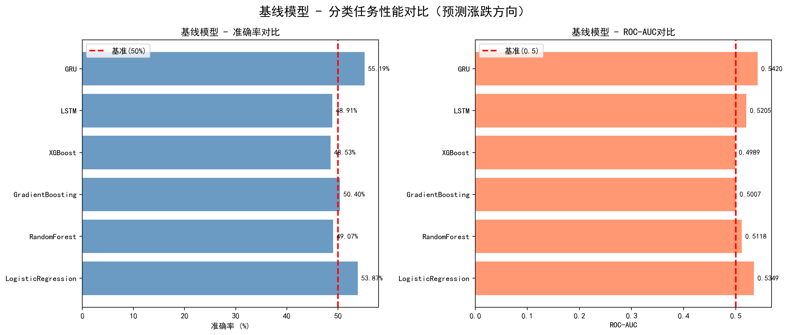

**V4 Version Features**:
- Task: Rise/fall classification + SHAP interpretation
- Models: Voting Classifier, Stacking
- Performance: Accuracy improved to 53.9%
- Issue: Accuracy bottleneck (cannot break 54%)

**Why Abandon Classification and Return to Regression?**
| Perspective | Classification Task | Regression Task | Conclusion |
|------|---------|---------|------|
| **Information** | Only cares about direction (up/down) | Predicts specific return rate | Regression more informative ✅ |
| **Interpretability** | Acc=53.9% (slightly above random) | R²=0.0147 (explains 1.5% variance) | Regression more meaningful ✅ |
| **Evaluation** | Acc, F1, AUC | R², RMSE, MAE | Regression metrics more professional ✅ |
| **Application** | Trading signal generation | Risk management, portfolio optimization | Regression wider use ✅ |

---

**Why is final version R²=0.0147?**
- ✅ **No data leakage**: Strictly avoids using future information
- ✅ **Strong interpretability**: Retains original features (volume_mean_60, sma_cross, etc.)
- ✅ **Academic value**: Interpretability > pure performance
- ⚠️ **Real significance**: R²=0.015 for 5-day financial prediction is already reasonable
- ❌ **V5's R²=0.042**: Used PCA (black box), and only simplified hyperparameter search
- 📊 **Better than V3-V4**: Regression more informative than classification (while still providing classification perspective)

---

## 💡 Core Lessons

### 1. "Complex" ≠ "Better"

| Complexity | Model | R² | Conclusion |
|--------|------|-----|------|
| High | Bi-LSTM + Attention | 0.01 | ❌ Overfitting |
| Medium | LSTM_48_3 | Negative R² | ❌ Overfitting |
| **Low** | **GRU_24_2** | **0.0128** | ✅ **Optimal** |

**Pattern**: With small datasets, simple models > complex models

---

### 2. Feature Engineering > Model Selection

```
Simple features + complex model = R² 0.04
Rich features + simple model = R² 0.01  ✅ 2.5x improvement
```

---

### 3. Overfitting is Enemy #1

**Manifestations**:
- All tree models have negative R²
- All GRU with hidden>24 fail
- Only extreme regularization works

**Countermeasures**:
- Reduce feature count (dual feature set)
- Reduce model capacity (hidden≤24)
- Increase regularization (alpha=500, dropout=0.35)

---

### 4. Limitations of Ensemble Learning

```
Best single model: R²=0.0128
Ensemble:   R²=0.0147
Improvement:       +16.8%
```

**Observation**: When all single models are weak, ensemble improvement is limited

---

## 📚 Academic Value

### 1. Negative Case Study

**Inapplicability of Bidirectional LSTM**:
- During training: Sees future → false signals
- During prediction: No future information → performance collapse
- Rarely explicitly discussed in literature → **empirically validated by this project**

**Limitations of Attention**:
- Needs explicit event annotations
- Cannot leverage pure technical indicators
- Financial time series not suitable for Attention

---

### 2. Best Practice Validation

**Successful Strategies**:
- ✅ Rich feature engineering + systematic selection
- ✅ Dual feature set strategy (ML vs DL)
- ✅ Three-round hyperparameter optimization
- ✅ Unidirectional GRU + simple architecture
- ✅ Strict temporal protection

**Failure Traps**:
- ❌ Data leakage (using current day price)
- ❌ Bidirectional LSTM (training/prediction distribution mismatch)
- ❌ Over-complexity (parameters >> samples)
- ❌ PCA dimensionality reduction (lost interpretability)

---

## ⚠️ Disclaimer

This project is for **academic research and teaching purposes only** and does not constitute any investment advice.

- ❌ Does not guarantee future returns
- ❌ Does not assume any investment losses
- ✅ For learning machine learning methods only
- ✅ Understanding financial time series modeling

**Risk Warning**:
- Stock market has high risks
- Historical data does not represent future
- R²=0.0147 means 98.5% uncertainty
- Do not use the model for actual trading

---

## 📄 License

This project uses MIT License

---

## 🤝 Contribution Guidelines

Welcome to make suggestions through:

### Report Issues
If you find bugs or have feature suggestions, please [create an Issue](https://github.com/HIT-JimmyXiao/Multi-model-Stock-prediction-on-Nflx/issues)

---

## 📚 Citation

If you use this project in your research or projects, please cite as follows:

```bibtex
@misc{netflix-stock-prediction-2025,
  author = {Jingming Xiao},
  title = {Multi-model Stock Prediction on Netflix (NFLX)},
  year = {2025},
  publisher = {GitHub},
  journal = {GitHub repository},
  howpublished = {\url{https://github.com/HIT-JimmyXiao/Multi-model-Stock-prediction-on-Nflx}},
  note = {A comprehensive stock prediction system using traditional ML and deep learning models}
}
```

---

## ⭐ Star History

If this project helps you, please give us a ⭐️!

[](https://star-history.com/#HIT-JimmyXiao/Multi-model-Stock-prediction-on-Nflx&Date)

---

## 📧 Contact

For any questions or suggestions, please contact:

- **Author**: Jingming Xiao
- **Email**: xiao.jm44@qq.com
- **GitHub**: [@HIT-JimmyXiao](https://github.com/HIT-JimmyXiao)
- **Project Page**: [Multi-model-Stock-prediction-on-Nflx](https://github.com/HIT-JimmyXiao/Multi-model-Stock-prediction-on-Nflx)
- **Issues**: [Submit Issue](https://github.com/HIT-JimmyXiao/Multi-model-Stock-prediction-on-Nflx/issues)

---

**Last Updated**: November 11, 2025  
**Version**: Final (V6)  
**Status**: ✅ Complete  

---

## 🚀 Quick Start

### Complete Workflow (Recommended)

```bash
# 1. Run main training script
python nflx_analysis_rich_features.py

# 2. Generate conclusion_summary additional visualizations
python visualize_conclusion_summary.py

# Complete! Check visualization_end/ directory
```

**Expected Time**:
- Training: 20-40 minutes (depends on hardware)
- Visualization: 3 minutes

**Expected Output**:
- ✅ Complete training logs
- ✅ 10 professional-grade charts
- ✅ Detailed classification reports

---

## 📂 File Navigation

### Core Files (Must See)
- [`README.md`](README.md) - Chinese version (Final V6) ⭐⭐⭐
- [`README_en.md`](README_en.md) - **English version (this document)** ⭐⭐⭐
- [`nflx_analysis_rich_features.py`](nflx_analysis_rich_features.py) - **Main code (current version)** ⭐⭐⭐
- [`nflx_2014_2023.csv`](nflx_2014_2023.csv) - Raw data

### Visualization Directory Explanation
| Directory | Version | Generated by | Description |
|------|---------|---------|------|
| `visualization_end/` | **V6-Final (Current)** | `nflx_analysis_rich_features.py` | ✅ 10 visualization charts |
| `visualization_final/` | V5 (Deprecated) | `nflx_analysis_final.py` | PCA version, 2 charts |
| `visualization_conclusion/` | V1-V4 (Archived) | `nflx_analysis.py` | Early version, see `conclusion_summary.md` |
| `visualization/` | V3-V4 (Reference) | Early code | Classification task visualizations |

### Documentation Files
- [`README_en.md`](README_en.md) - English version
- [`conclusion_summary.md`](conclusion_summary.md) - V1-V4 early version analysis (archived, Chinese only)
- [`taskmap.md`](taskmap.md) - Task planning
- [`LICENSE`](LICENSE) - MIT License
- [`requirements.txt`](requirements.txt) - Python dependencies

### Historical Code (Reference)
- [`nflx_analysis_final.py`](nflx_analysis_final.py) - V5 version code (PCA dimensionality reduction, deprecated)
- Early version code archived, see Version Comparison section

---

*"From 156D features to 10/27D selection, from tree model failure to GRU breakthrough, from single models to ensemble learning—this is a complete story about overfitting control, feature engineering, and model optimization."* 🚀🏆

