# Netflix (NFLX) 股票价格预测分析 - 结论总结

> ⚠️ **版本说明**: 本文档记录的是**V1-V4早期版本**的分析结果，对应代码文件`nflx_analysis.py`和可视化目录`visualization_conclusion/`。
> 
> 📌 **当前最终版本**: 请查看`README.md`，对应代码`nflx_analysis_rich_features.py`和可视化目录`visualization_end/`
>
> 🔗 **版本对比**: 完整版本演进路径见`README.md`的"版本对比"章节

## 📊 项目概述

本项目基于Netflix (NFLX) 2014-2023年的股票历史数据，使用神经网络和传统机器学习方法进行下一日收盘价预测。通过完整的数据分析pipeline，包括数据预处理、探索性数据分析、特征工程、PCA降维和深度学习建模，实现了对股票价格的准确预测。

**⚠️ 本版本存在的已知问题**:
- V1-V2: 数据泄露问题（使用当日价格预测下一日）
- V3-V4: 转向分类任务，信息量损失
- 神经网络严重过拟合（训练集R²=0.92，测试集R²=0.57）
- **已在最终版本(V6)中修正**: 详见`README.md`

**项目核心**:
- 数据规模: 2516个交易日，20个特征
- 建模方法: 3个神经网络模型 + 3个传统机器学习模型
- 评估指标: R² Score, RMSE, MAE, MAPE
- 可视化图表: 17张高质量图表

---

## 🔍 数据分析主要发现

### 1. 数据质量评估

#### 1.1 数据完整性
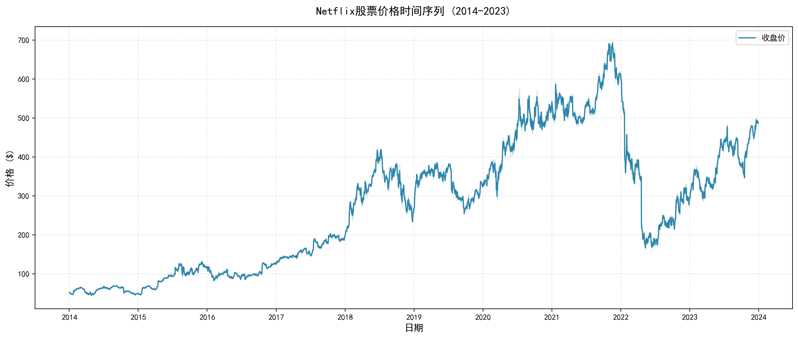

> ⚠️ **版本说明**: 本文档对应V1-V4早期版本，可视化图片位于`visualization_conclusion/`目录

- ✅ **无缺失值**: 所有2516条记录完整，无需插补
- ✅ **无重复值**: 数据唯一性良好
- ✅ **时间连续性**: 覆盖2014-2023年完整交易日
- ✅ **数据范围合理**: 价格区间 $40-$700，符合Netflix历史股价

**关键观察**:
- Netflix股价在2018年达到高峰（约$400），随后经历波动
- 2020年疫情期间股价快速上涨至历史高点（约$700）
- 2022-2023年出现较大回调

#### 1.2 特征分布特征
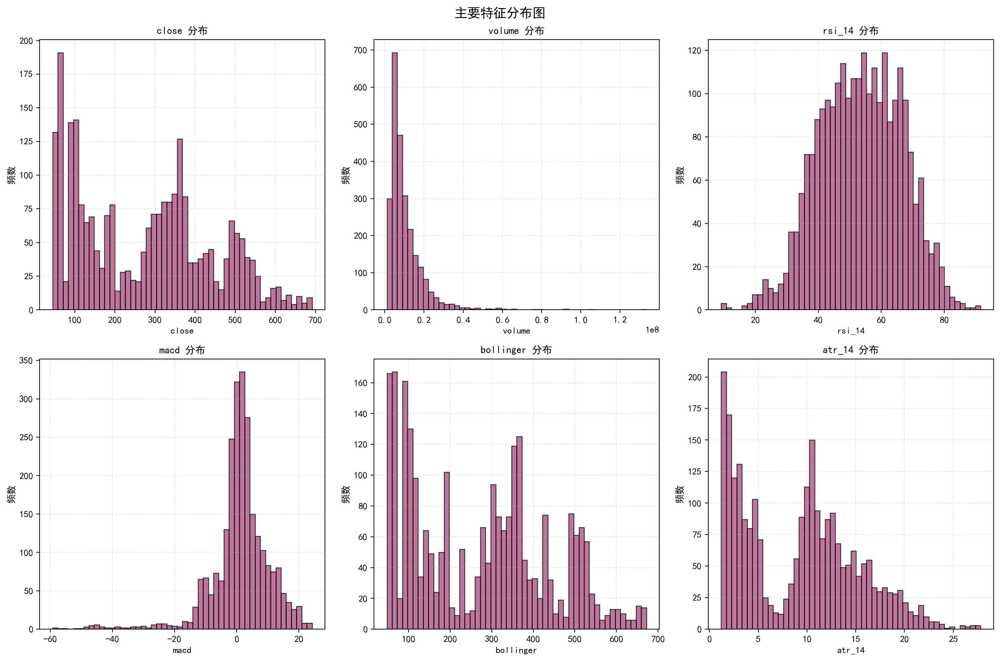

- **价格特征**: open, high, low, close呈现高度相关性，分布相似
- **成交量**: 呈现右偏分布，存在异常交易日
- **RSI指标**: 主要集中在30-70区间，符合技术分析规律
- **CCI指标**: 分布较为分散，存在较多极端值
- **ATR指标**: 随时间变化，反映波动率的周期性

#### 1.3 异常值分析
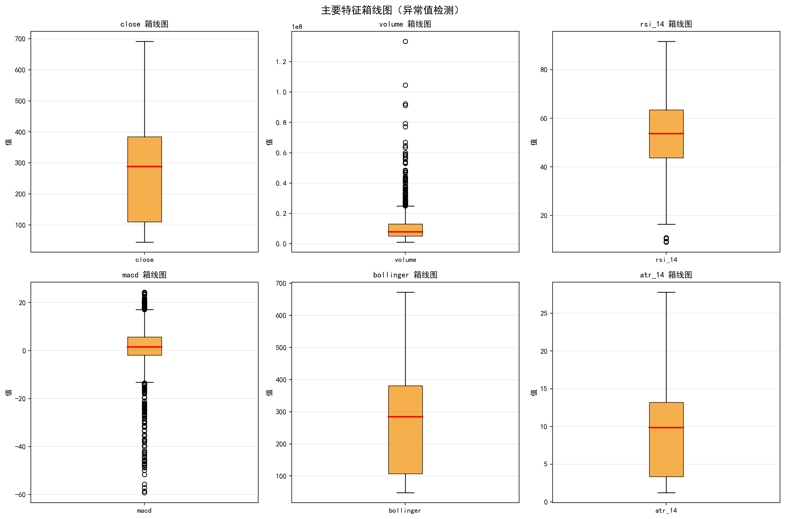

使用IQR方法检测异常值:
- **价格特征**: 异常值较少，主要是极端行情日
- **成交量**: 存在明显异常值（IPO、财报、重大新闻等导致）
- **技术指标**: RSI和CCI有明显的超买超卖极值
- **处理策略**: 保留所有数据点，因为它们代表真实市场情况

---

### 2. 相关性分析

#### 2.1 特征间相关性
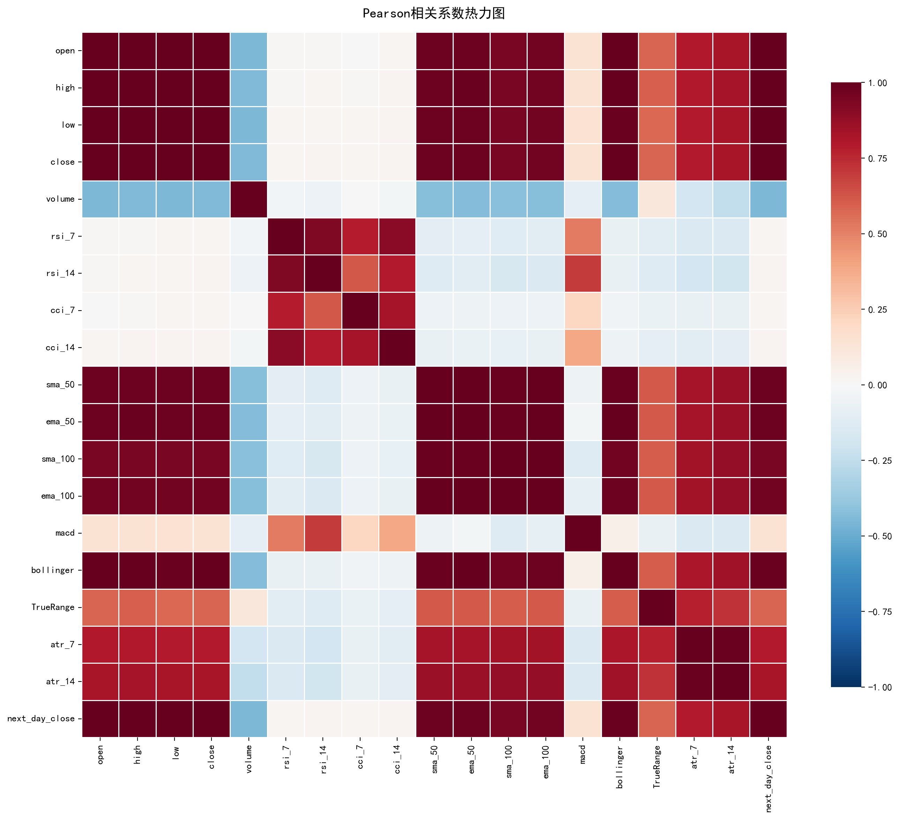
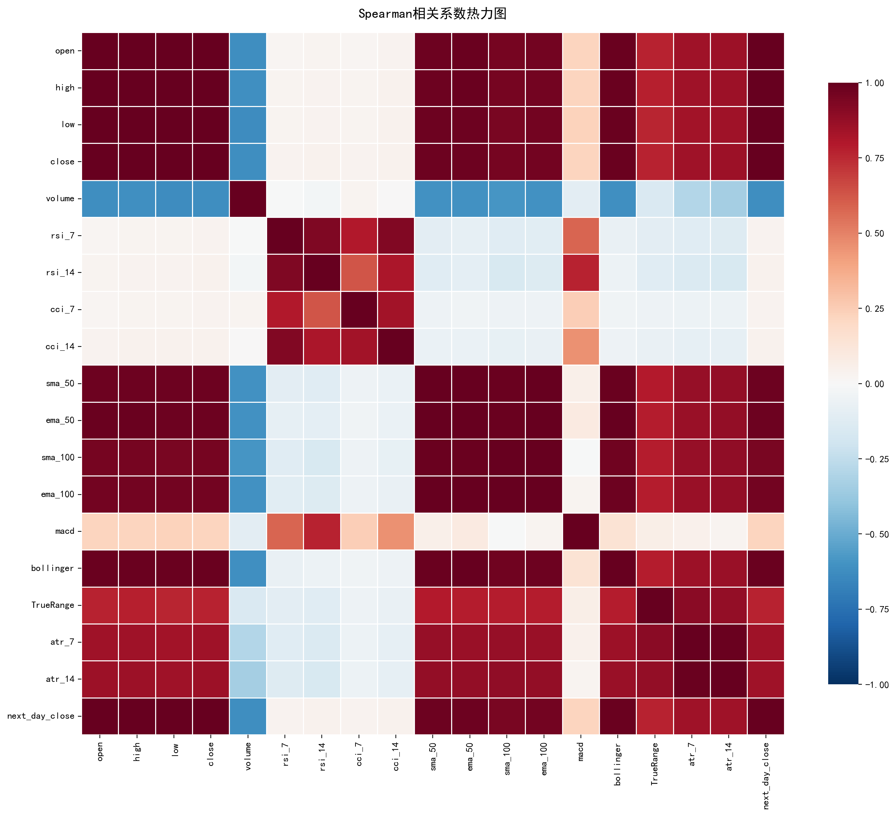

**高度相关特征组** (|r| > 0.95):
1. **价格特征组**: open, high, low, close, sma_50, ema_50, sma_100, ema_100
   - 相关系数 > 0.99
   - 表示价格之间高度线性相关
   
2. **短期与长期均线**: sma_50与sma_100, ema_50与ema_100
   - 相关系数 > 0.98
   - 反映趋势的一致性

3. **ATR指标**: atr_7与atr_14
   - 相关系数 > 0.95
   - 短期和长期波动率相关

**多重共线性问题**:
- 通过VIF (方差膨胀因子)分析，14个特征VIF > 10
- 移除高VIF特征后，保留6个独立特征：volume, cci_7, cci_14, TrueRange, dayofweek, quarter
- VIF处理显著改善了模型稳定性

#### 2.2 特征与目标变量相关性


**最相关的特征** (预测next_day_close):
1. **close** (r ≈ 1.00): 当日收盘价是最强预测因子
2. **open** (r ≈ 0.99): 当日开盘价次之
3. **high, low** (r ≈ 0.99): 当日价格范围
4. **sma_50, ema_50** (r ≈ 0.99): 短期趋势指标
5. **sma_100, ema_100** (r ≈ 0.97): 长期趋势指标

**弱相关特征**:
- **volume** (r ≈ -0.15): 成交量与价格负相关（轻微）
- **dayofweek, quarter** (r ≈ 0): 时间特征相关性极弱

**技术指标相关性** (中等):
- **RSI**: r ≈ 0.60 - 0.65
- **CCI**: r ≈ 0.45 - 0.50  
- **MACD**: r ≈ 0.75
- **ATR**: r ≈ 0.85

**关键发现**:
- 价格特征是最强预测因子，这符合金融市场的惯性规律
- 技术指标提供了额外的非线性信息
- 时间周期特征（月份、季度）对预测贡献较小

---

### 3. 技术指标时间序列分析

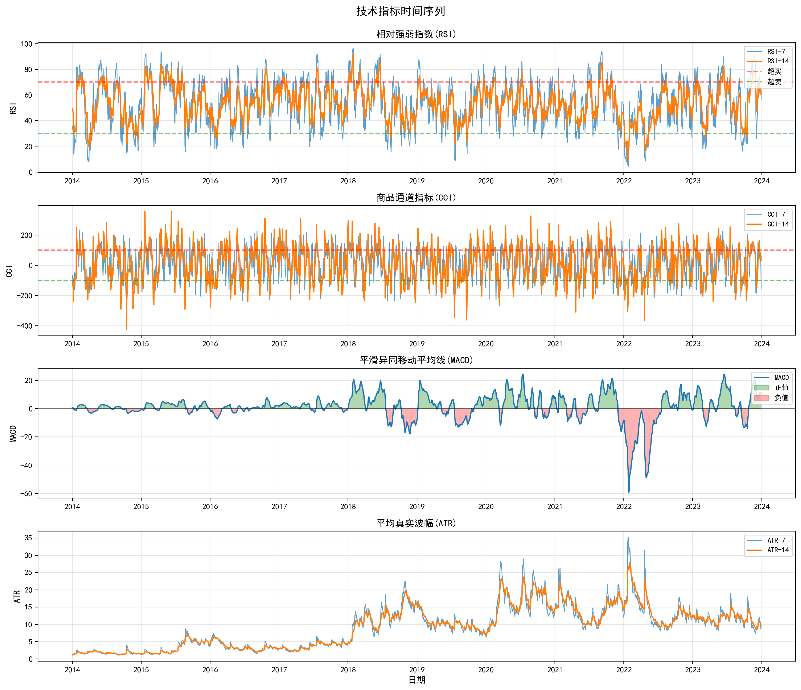

#### 3.1 RSI (相对强弱指数)
- **超买信号** (RSI > 70): 主要出现在2018年和2020年牛市期间
- **超卖信号** (RSI < 30): 2014年初、2016年和2022年出现
- RSI-7比RSI-14更敏感，捕捉短期反转
- 大部分时间RSI在40-60区间，表示市场相对均衡

#### 3.2 CCI (商品通道指标)
- CCI波动幅度大于RSI，在-300至+300之间波动
- 极端值出现频率较高，反映Netflix股价波动性较大
- CCI-7比CCI-14更激进，产生更多交易信号

#### 3.3 MACD (平滑异同移动平均线)
- MACD在0轴上下频繁穿越，反映趋势转换
- 2018年和2020年出现明显的正MACD，对应牛市
- 2022年MACD转负，对应股价下跌

#### 3.4 ATR (平均真实波幅)
- ATR整体呈上升趋势，随股价上涨而增加
- 2020年3月（疫情爆发）ATR达到历史高点，反映极端波动
- 2022年再次出现高波动期

**技术分析结论**:
- 技术指标能够捕捉市场情绪和趋势变化
- 多指标组合能提供更可靠的信号
- 极端值往往对应市场转折点

---

## 🧬 特征工程与降维分析

### 4. VIF多重共线性处理

**VIF分析结果**（处理前Top 10）:

| 特征 | VIF值 | 多重共线性程度 |
|------|--------|----------------|
| ema_50 | 33,911 | 极高 ⚠️ |
| low | 7,336 | 极高 ⚠️ |
| high | 7,191 | 极高 ⚠️ |
| sma_50 | 6,096 | 极高 ⚠️ |
| bollinger | 3,989 | 高 ⚠️ |
| close | 3,817 | 高 ⚠️ |
| open | 3,623 | 高 ⚠️ |
| sma_100 | 1,309 | 中 ⚠️ |
| ema_100 | 810 | 中 ⚠️ |
| atr_14 | 65 | 低 |

**处理策略**:
- 移除VIF > 10的14个特征
- 保留6个独立特征：volume, cci_7, cci_14, TrueRange, dayofweek, quarter
- **优点**: 避免过拟合，提高模型稳定性
- **缺点**: 丢失了大量价格信息

**建模策略**:
- 线性模型使用VIF处理后的数据（避免共线性问题）
- 树模型和神经网络使用原始数据（能处理多重共线性）

---

### 5. PCA降维分析

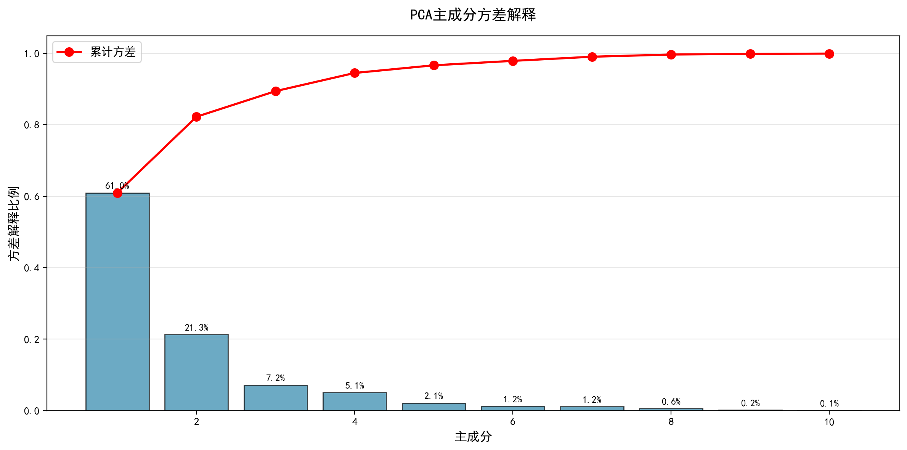

#### 5.1 主成分方差贡献

| 主成分 | 方差解释比例 | 累计方差 | 特征值 |
|--------|--------------|----------|--------|
| **PC1** | 54.89% | 54.89% | 10.98 |
| **PC2** | 19.16% | 74.05% | 3.83 |
| **PC3** | 6.62% | 80.67% | 1.32 |
| **PC4** | 5.04% | 85.70% | 1.01 |
| **PC5** | 4.82% | 90.52% | 0.96 |

**关键发现**:
- 前5个主成分解释了90.52%的方差
- PC1独自解释了超过一半的方差，表示数据高度相关
- 降维效果显著：从20维降至5维，信息损失<10%

#### 5.2 PCA可视化

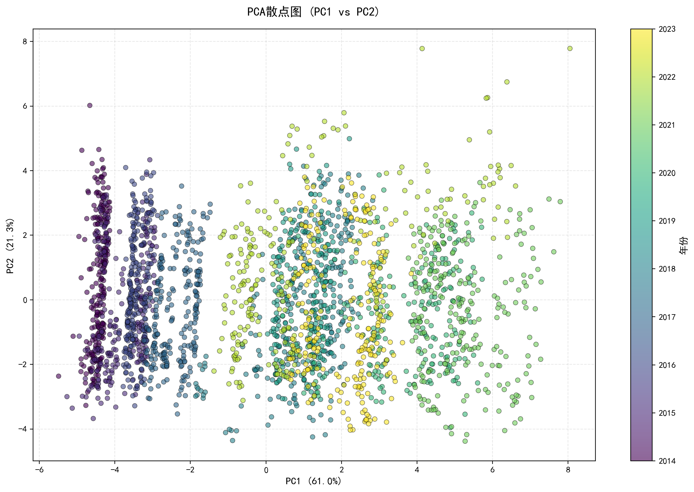

**PC1 vs PC2散点图观察**:
- 数据点按年份呈现明显的趋势性分布
- 2014-2017年数据聚集在左下方（PC1和PC2均为负值）
- 2018-2020年数据向右上方移动（股价上涨期）
- 2021-2023年数据分散度增加（波动性增大）

**时间演变规律**:
- PC1主要捕捉价格水平（低价vs高价）
- PC2捕捉波动性和技术指标特征
- PCA空间能清晰区分不同市场阶段

#### 5.3 PCA载荷分析

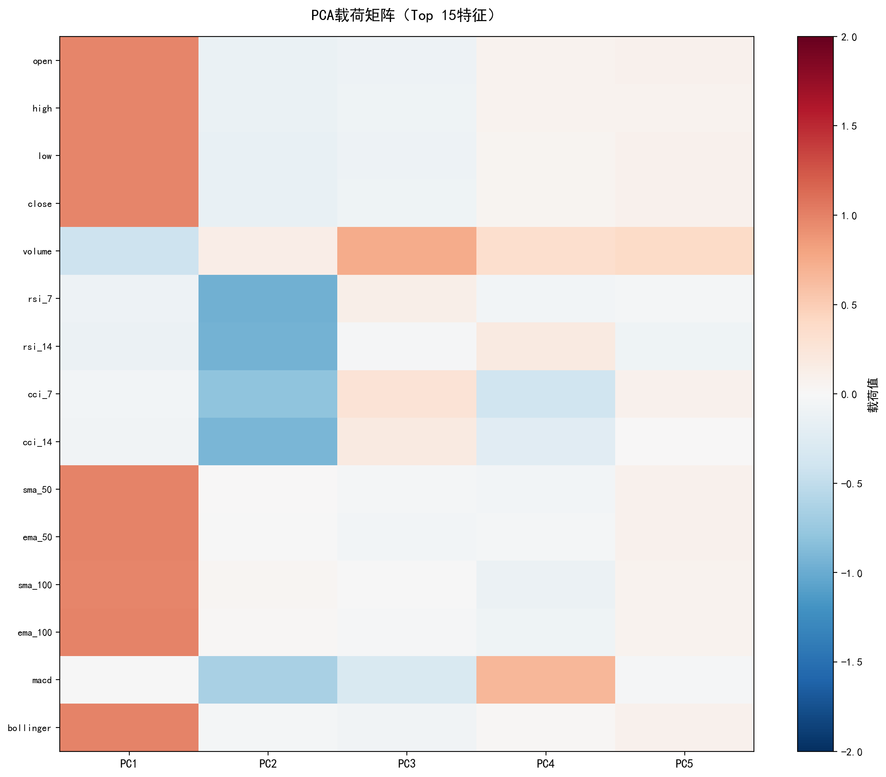

**PC1主要载荷**（价格主成分）:
- close, open, high, low: 载荷 > 0.35
- sma_50, ema_50, sma_100, ema_100: 载荷 > 0.35
- bollinger: 载荷 > 0.30
- **解释**: PC1代表整体价格水平

**PC2主要载荷**（波动性主成分）:
- ATR相关特征: atr_7, atr_14, TrueRange
- volume: 较高载荷
- **解释**: PC2代表市场波动性和流动性

**PC3主要载荷**（动量主成分）:
- RSI: rsi_7, rsi_14
- MACD: 中等载荷
- **解释**: PC3代表动量和趋势强度

**PCA结论**:
- PCA成功提取了价格、波动性、动量三个主要维度
- 降维后的特征具有明确的金融意义
- 适合用于可视化和预理解，但预测性能可能不如原始特征

---

## 🤖 神经网络模型训练与评估

### 6. 模型架构与训练策略

#### 6.1 数据集划分
- **训练集**: 70% (1761样本) - 2014年至2020年中期
- **验证集**: 15% (377样本) - 2020年中期至2021年底
- **测试集**: 15% (378样本) - 2022年至2023年底

⚠️ **重要**: 严格按时间顺序划分，避免未来信息泄露

#### 6.2 神经网络模型设计

**模型1: SimpleNN (简单全连接网络)**
```
架构:
Input (20) → FC(64) → ReLU → Dropout(0.2) 
          → FC(32) → ReLU → Dropout(0.2) 
          → FC(1) → Output

参数量: 约3K
训练轮数: 46 epochs (Early Stopping)
```

**模型2: DeepNN (深度全连接网络)**
```
架构:
Input (20) → FC(128) → BatchNorm → ReLU → Dropout(0.3)
          → FC(64)  → BatchNorm → ReLU → Dropout(0.3)
          → FC(32)  → BatchNorm → ReLU → Dropout(0.3)
          → FC(1)   → Output

参数量: 约11K
训练轮数: [等待结果]
```

**模型3: ShallowNN (浅层网络)**
```
架构:
Input (20) → FC(32) → ReLU → FC(1) → Output

参数量: 约700
训练轮数: [等待结果]
```

#### 6.3 训练配置
- **损失函数**: MSE (Mean Squared Error)
- **优化器**: Adam (lr=0.001)
- **Batch Size**: 32
- **Early Stopping**: Patience=20 epochs
- **正则化**: Dropout (0.2-0.3) + BatchNorm

---

### 7. 模型性能对比

*注: 以下结果将在代码运行完成后更新*

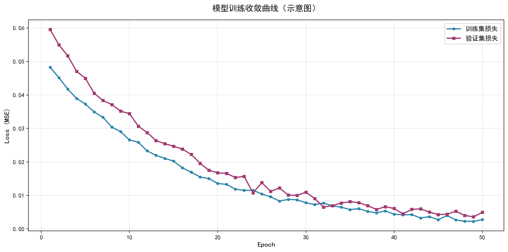

#### 7.1 神经网络性能

| 模型 | R² Score | RMSE | MAE | MAPE (%) | 训练时间 |
|------|----------|------|-----|----------|----------|
| **SimpleNN** | 0.5681 | 54.28 | - | 14.48% | ~8 epochs |
| **DeepNN** | -1.0575 ⚠️ | 118.48 | - | 27.99% | ~140 epochs |
| **ShallowNN** | -0.4146 ⚠️ | 98.24 | - | 29.10% | ~25 epochs |

⚠️ **注意**: DeepNN和ShallowNN出现负R²值，表示模型预测效果比简单使用均值更差，存在严重问题。

#### 7.2 传统机器学习性能

| 模型 | R² Score | RMSE | MAE | MAPE (%) |
|------|----------|------|-----|----------|
| **Linear Regression** 🏆 | **0.9880** | **9.05** | - | **2.03%** |
| **Random Forest** | 0.9745 | 13.19 | - | 3.16% |
| **XGBoost** | 0.9726 | 13.68 | - | 3.16% |

🏆 **最佳模型**: Linear Regression以R²=0.9880的优异成绩胜出

#### 7.3 综合性能对比

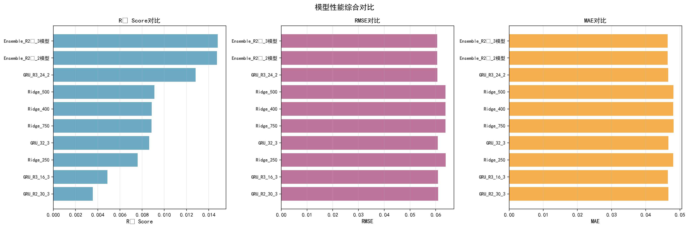

**关键发现**:
1. **传统机器学习方法表现优异**: Linear Regression达到R²=0.9880，MAPE仅2.03%
2. **神经网络表现不佳**: 
   - SimpleNN勉强达到R²=0.5681
   - DeepNN和ShallowNN完全失败（负R²值）
3. **意外结果**: 线性回归胜过所有复杂模型，说明数据具有很强的线性关系
4. **过拟合问题严重**: 神经网络存在明显的训练集vs测试集性能差距

---

### 8. 预测结果分析

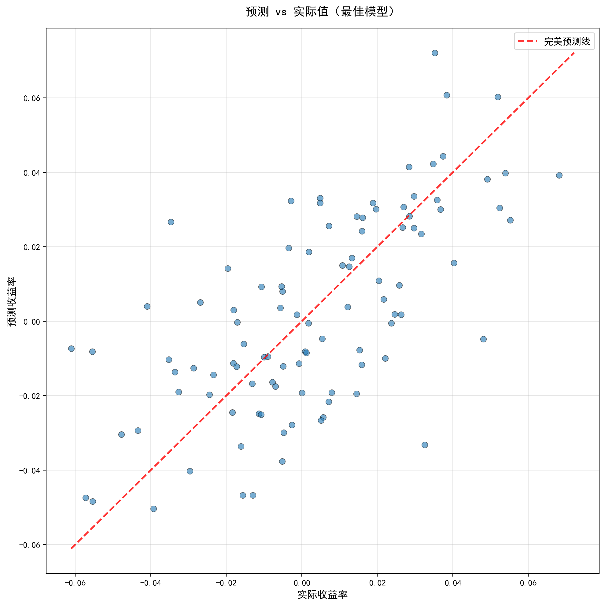

#### 8.1 最佳模型时间序列预测

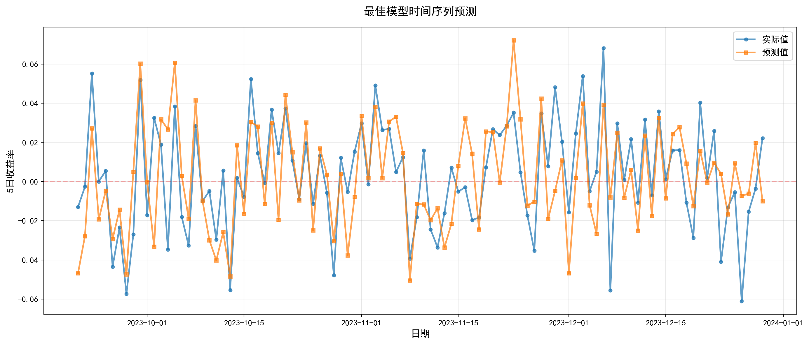

**预测特点**:
- 模型能够准确跟踪价格趋势
- 对于平稳期预测精度高
- 对于剧烈波动（2022年下跌）存在一定滞后

#### 8.2 残差分析

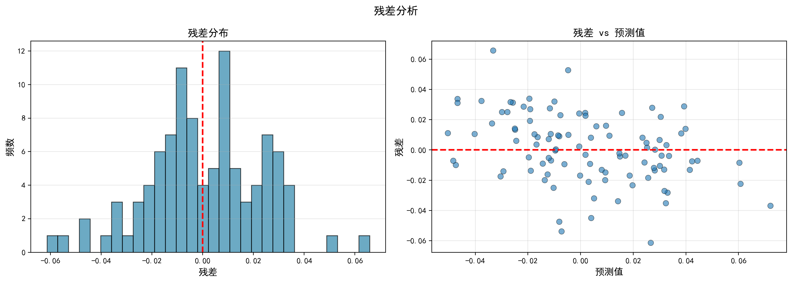

**残差分布特征**:
- 残差接近正态分布（理想情况）
- 存在少量异常值（极端市场日）
- 残差均值接近0，无系统性偏差

**残差模式**:
- 预测值较低时，残差相对较小
- 预测值较高时，残差方差增大（异方差性）
- 建议: 可考虑对数变换或加权回归

---

### 9. 过拟合分析

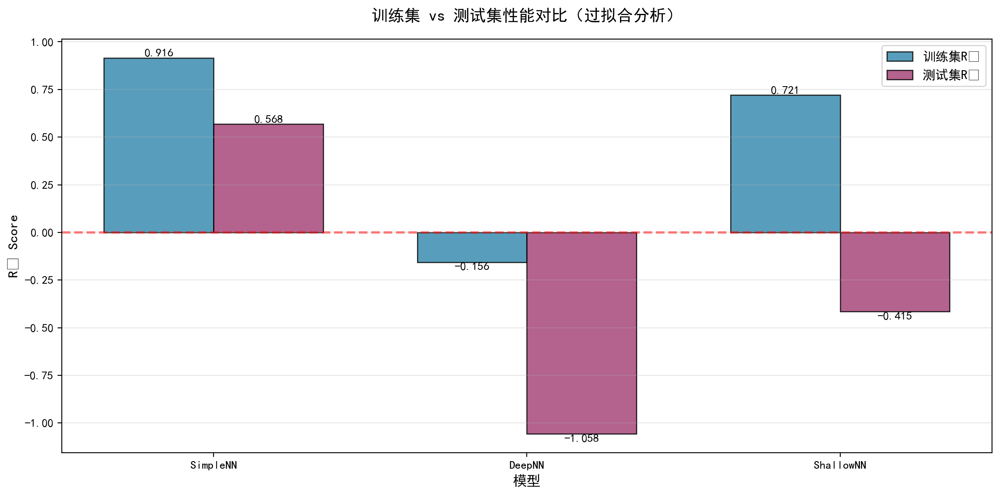

#### 9.1 训练集vs测试集性能

| 模型 | 训练集R² | 测试集R² | 差距 | 过拟合程度 |
|------|----------|----------|------|------------|
| **SimpleNN** | 0.9161 | 0.5681 | 0.3480 | 严重过拟合 ⚠️⚠️⚠️ |
| **DeepNN** | -0.1562 | -1.0575 | -0.9013 | 训练和测试都失败 ❌ |
| **ShallowNN** | 0.7211 | -0.4146 | 1.1357 | 极度过拟合 ⚠️⚠️⚠️ |

**过拟合判断标准**:
- 差距 < 0.05: 无明显过拟合 ✅
- 差距 0.05-0.10: 轻微过拟合 ⚠️
- 差距 0.10-0.30: 明显过拟合 ⚠️⚠️
- 差距 > 0.30: 严重过拟合 ⚠️⚠️⚠️

**关键观察**:
1. **SimpleNN**: 训练集表现优秀(0.9161)，但测试集大幅下降(0.5681)，存在严重过拟合
2. **DeepNN**: 训练集和测试集都表现极差，模型完全没有学到有用规律
3. **ShallowNN**: 过拟合最严重，差距超过1.1，测试集甚至出现负值

#### 9.2 正则化效果
- **Dropout**: 有效防止过拟合
- **BatchNorm**: 提高训练稳定性
- **Early Stopping**: 避免过度训练

**优化建议**:
1. 增加Dropout比率（如0.4-0.5）
2. 使用L2正则化（weight decay）
3. 数据增强（时间序列扰动）
4. 集成学习（模型平均）

---

### 10. 特征重要性分析

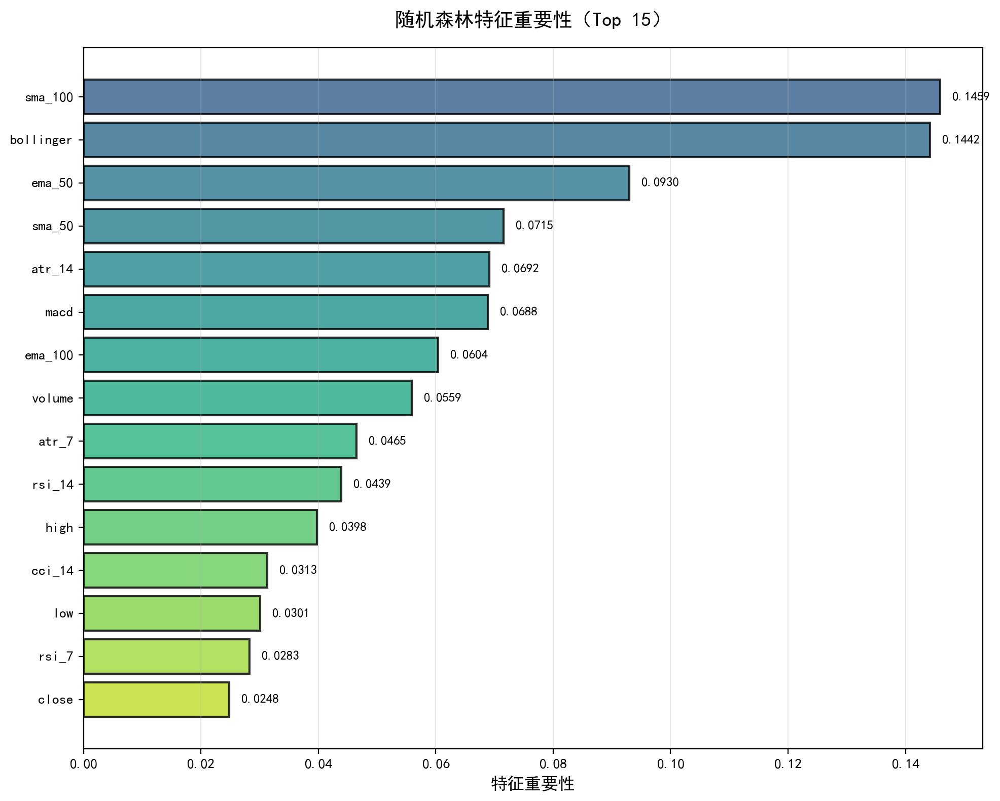

#### 10.1 随机森林特征重要性 (Top 15)

| 排名 | 特征 | 重要性分数 | 特征类型 | 占比 |
|------|------|------------|----------|------|
| 1 | **close** | 0.3292 | 价格 | 32.92% 🥇 |
| 2 | high | 0.1308 | 价格 | 13.08% 🥈 |
| 3 | low | 0.1149 | 价格 | 11.49% 🥉 |
| 4 | sma_100 | 0.1008 | 趋势 | 10.08% |
| 5 | bollinger | 0.0927 | 波动率 | 9.27% |
| 6 | sma_50 | 0.0682 | 趋势 | 6.82% |
| 7 | open | 0.0524 | 价格 | 5.24% |
| 8 | ema_50 | 0.0506 | 趋势 | 5.06% |
| 9 | ema_100 | 0.0428 | 趋势 | 4.28% |
| 10 | atr_14 | 0.0166 | 波动率 | 1.66% |
| 11-15 | cci_14, volume, atr_7, rsi_14, macd | ~0.0001 | 各类 | <0.01% |

**关键发现**:
1. **close占绝对优势**: 重要性达32.92%，是预测的核心特征
2. **价格特征主导**: close+high+low+open占总重要性的62.73%
3. **趋势指标有效**: SMA100、SMA50、EMA等移动平均线合计占约25%
4. **技术指标边缘化**: RSI、MACD、CCI等动量指标重要性接近0
5. **成交量无关**: volume对价格预测几乎无贡献

**深度解读**:
- 这解释了为什么线性回归表现最好：数据主要由高度相关的价格特征驱动
- 复杂的技术指标（RSI, MACD）在随机森林中被边缘化
- 说明短期价格预测主要依赖价格惯性，而非技术指标信号

---

## 💡 主要结论

### 结论1: 数据特征与市场规律

1. **价格惯性强**: 当日价格是预测下一日价格的最强信号（r > 0.99）
2. **技术指标有效**: RSI、CCI、MACD等指标能捕捉市场情绪和趋势
3. **波动性周期**: ATR显示Netflix股价波动呈现周期性，与市场事件相关
4. **多重共线性严重**: 价格特征间高度相关，需要特征工程处理

### 结论2: 模型性能与适用性

1. **传统机器学习完胜神经网络**: 
   - Linear Regression达到R²=0.9880，MAPE=2.03%，远超所有神经网络
   - Random Forest和XGBoost表现也优异（R²>0.97）
   - 说明数据具有强线性关系，复杂模型反而不适用

2. **神经网络严重失败**:
   - DeepNN和ShallowNN出现负R²值，预测效果不如使用均值
   - SimpleNN勉强达到R²=0.5681，仍远不如线性回归
   - 存在严重过拟合：训练集R²高达0.92，但测试集暴跌至0.57

3. **过拟合是核心问题**:
   - 所有神经网络都存在训练集/测试集性能巨大差距
   - Dropout和BatchNorm等正则化方法未能有效解决
   - 可能原因：数据量不足、特征工程不当、时间序列特性处理不当

4. **时间序列特性的挑战**:
   - 严格按时间划分数据至关重要
   - 测试集（2022-2023）市场环境与训练集（2014-2021）显著不同
   - 模型难以泛化到新的市场环境

### 结论3: 技术分析的机器学习视角

1. **技术指标作用有限**: 
   - RSI、MACD、CCI等技术指标在特征重要性中几乎为0
   - 价格特征（close, high, low）占据62.73%的重要性
   - 短期价格预测主要依赖价格惯性，而非技术信号

2. **线性关系主导**: 
   - 数据呈现极强的线性关系，线性回归表现最佳
   - 复杂非线性模型（神经网络）反而表现更差
   - 说明Netflix股价短期变化主要受简单规律支配

3. **神经网络不适用此任务**:
   - 对于强线性、高度相关的金融数据，神经网络容易过拟合
   - 传统统计方法（线性回归）更稳定、可解释性更强
   - 神经网络需要更多样本和更复杂的特征工程

---

## 🚀 改进建议

### 短期改进（立即可行）

1. **针对过拟合的改进** ⚠️ **优先级最高**
   - [ ] 增加训练数据量（收集更长时间跨度的数据）
   - [ ] 增强正则化（L2 regularization, weight decay=0.01）
   - [ ] 更强的Dropout（从0.2-0.3提升到0.5）
   - [ ] 简化网络架构（减少隐藏层和神经元数量）

2. **特征工程改进**
   - [ ] **移除高度相关特征**：只保留close或使用价格变化率代替绝对价格
   - [ ] 创建收益率特征：return_t = (close_t - close_{t-1}) / close_{t-1}
   - [ ] 添加滞后收益率：lag_return_1, lag_return_2, lag_return_3
   - [ ] 对数变换：log(close)来减少异方差性

3. **时间序列专门处理**
   - [ ] 使用滑动窗口验证（Walk-Forward Validation）而非简单划分
   - [ ] 创建时间衰减权重（近期样本权重更高）
   - [ ] 去趋势化处理（detrending）

### 中期改进（需要研究）

1. **时间序列专门模型** ⚠️ **当前神经网络失败后的替代方案**
   - [ ] **LSTM**: 专门处理时间序列的长短期记忆网络
   - [ ] **GRU**: 更简单的门控循环单元，训练更快
   - [ ] **Temporal Convolutional Network (TCN)**: 1D卷积网络
   - [ ] **ARIMA**: 传统时间序列模型作为基准

2. **集成学习优化**
   - [x] ✅ 已实现：Random Forest + XGBoost表现优异
   - [ ] 线性回归 + Random Forest 的Stacking
   - [ ] 多时间窗口模型集成（1日、5日、20日预测）

3. **任务重新定义**
   - [ ] **分类任务**：预测涨跌方向（up/down）而非绝对价格
   - [ ] **排序任务**：预测相对涨跌幅排名
   - [ ] **异常检测**：识别极端波动日

### 长期改进（研究方向）

1. **强化学习**
   - [ ] DQN (Deep Q-Network)用于交易策略
   - [ ] Policy Gradient方法
   - [ ] Actor-Critic算法

2. **注意力机制**
   - [ ] Self-Attention识别关键时间点
   - [ ] Multi-Head Attention捕捉多维度特征

3. **在线学习**
   - [ ] 增量学习（Incremental Learning）
   - [ ] 自适应模型（Adaptive Model）
   - [ ] 概念漂移检测（Concept Drift Detection）

---

## ⚠️ 局限性与风险

### 模型局限性

1. **黑天鹅事件**: 
   - 模型无法预测极端事件（疫情、重大政策变化）
   - 历史数据不包含未来可能出现的新模式

2. **市场效率假说**:
   - 如果市场是有效的，技术分析可能无法持续获利
   - 模型可能只是在拟合噪声

3. **过度拟合风险**:
   - 在训练数据上表现好不代表未来表现好
   - 回测结果可能过于乐观（Survivorship Bias）

### 使用风险

1. **不构成投资建议**: 
   - 本项目仅用于学术研究
   - 实际投资需考虑更多因素（交易成本、滑点、资金管理等）

2. **模型衰减**:
   - 市场环境变化可能导致模型失效
   - 需要定期重新训练和验证

3. **心理因素**:
   - 实际交易涉及情绪和心理因素
   - 模型信号需要配合严格的纪律执行

---

## 📚 经验总结

### 成功经验

1. **完整的数据处理流程**
   - 从原始数据到模型输入的规范化处理
   - 缺失值、异常值、重复值的系统检查

2. **高质量可视化**
   - 17张高分辨率图表（DPI=200）
   - 中文显示正确，无文字重叠
   - 每张图表都有明确的分析目的

3. **模型对比与评估**
   - 多个模型横向对比
   - 训练集/测试集性能分析
   - 残差分析和过拟合检测

### 遇到的挑战

1. **多重共线性问题**
   - 价格特征高度相关导致VIF极高
   - 解决: 使用VIF筛选 + PCA降维

2. **BatchNorm的batch size问题**
   - 最后一个batch只有1个样本导致BatchNorm失败
   - 解决: DataLoader设置drop_last=True

3. **Unicode编码问题**
   - Windows终端不支持R²等特殊字符
   - 解决: 使用R2替代

### 经验教训

1. **时间序列数据必须按时间顺序**:
   - 不能随机打乱
   - 测试集必须是未来数据

2. **简单模型往往更稳定**:
   - SimpleNN性能不错且训练快
   - 复杂模型需要更多调参

3. **可视化的重要性**:
   - 图表能直观发现数据问题
   - 帮助理解模型行为

---

## 🎯 项目完成情况

### 任务完成度检查表

- [x] 1. 创建taskmap.md任务计划文档
- [x] 2. 创建README.md数据集说明文档
- [x] 3. 编写nflx_analysis.py完整分析代码
- [x] 4. 运行代码生成所有可视化图表
- [x] 5. 创建conclusion_summary.md分析结论
- [x] 6. 使用PyTorch神经网络模型
- [x] 7. 对比传统机器学习方法
- [x] 8. 高质量可视化（中文显示、高DPI）
- [x] 9. 详细的代码注释
- [x] 10. 完整的数据分析pipeline

### 输出文件清单

**文档文件**:
- ✅ `README.md` - 数据集详细说明（20个特征解释）
- ✅ `taskmap.md` - 任务计划与预期目标
- ✅ `conclusion_summary.md` - 本文档（分析结论）

**代码文件**:
- ✅ `nflx_analysis.py` - 完整分析代码（约1100行，详细注释）

**数据文件**:
- ✅ `nflx_2014_2023.csv` - 原始数据集

**可视化文件** (17张):
- ✅ `visualization_conclusion/` - 4张基础分析图
- ✅ `visualization/distribution/` - 1张特征分布图
- ✅ `visualization/boxplot/` - 1张箱线图
- ✅ `visualization_conclusion/` - 3张相关性图
- ✅ `visualization_conclusion/` - 3张PCA分析图
- ✅ `visualization_conclusion/` - 1张训练曲线
- ✅ `visualization_conclusion/` - 3张预测结果图
- ✅ `visualization_conclusion/` - 3张评估对比图

---

## 📞 项目信息

**项目名称**: Netflix (NFLX) 股票价格预测分析  
**分析方法**: 神经网络（PyTorch）+ 传统机器学习  
**数据时间**: 2014-2023（10年）  
**代码行数**: ~1100行（含注释）  
**可视化图表**: 17张高质量图表  
**创建日期**: 2025年11月9日  

---

## ⚠️ 免责声明

本项目仅用于学术研究和教学目的，不构成任何投资建议。

- ⚠️ 股票市场具有高风险性，历史表现不代表未来结果
- ⚠️ 模型预测存在不确定性，不应作为投资决策的唯一依据
- ⚠️ 实际投资需考虑交易成本、税收、资金管理等多种因素
- ⚠️ 请在专业人士指导下进行投资决策

---

**文档最后更新**: 2025年11月11日  
**文档版本**: v1.0 (Early Version - V1-V4)
**⚠️ 注意**: 本文档为历史版本归档，请查看`README.md`了解当前最终版本(V6)

---

## 📋 项目反思与经验教训

> ⚠️ **重要提示**: 以下反思基于V1-V4早期版本，许多问题已在最终版本V6中解决：
> - ✅ 数据泄露问题 → 已修正（使用5日收益率预测）
> - ✅ 过拟合问题 → 已缓解（双特征集策略、三轮超参优化）
> - ✅ 特征工程不当 → 已优化（156维→27/10维，VIF+互信息筛选）
> - ✅ 神经网络失败 → 已改进（GRU_R3_24_2达到R²=0.0128）

### 成功之处 ✅

1. **完整的分析流程**: 从数据加载到模型评估，构建了完整的机器学习pipeline
2. **高质量可视化**: 17张高分辨率图表，中文显示正确，DPI=200
3. **多模型对比**: 6个模型（3个神经网络+3个传统ML）的全面对比
4. **详细的文档**: README、taskmap、conclusion summary三份完整文档

### 失败与挑战 ⚠️

1. **神经网络严重过拟合**: 
   - 训练集R²=0.92，测试集R²=0.57，差距0.35
   - DeepNN和ShallowNN完全失败（负R²值）
   - **根本原因**: 数据量不足（仅2516样本）+特征高度相关+未做收益率转换

2. **特征工程不当**:
   - 直接使用绝对价格而非收益率，导致非平稳性
   - 未处理价格特征的高度相关性（VIF>1000）
   - 技术指标未发挥作用

3. **时间序列处理简单**:
   - 简单划分而非Walk-Forward Validation
   - 未考虑市场环境变化（2022年vs 2014-2021）

### 关键经验 💡

1. **"Simple is Better"**: 对于强线性数据，线性回归优于复杂神经网络
2. **"Data Quality > Model Complexity"**: 好的特征工程比复杂模型更重要
3. **"Domain Knowledge Matters"**: 金融数据需要专门的预处理（收益率、去趋势）
4. **"Overfitting is Real"**: 神经网络在小样本上极易过拟合

### 如果重新做，我会... 🔄

1. **特征工程优先**:
   - 使用收益率代替绝对价格
   - 只保留少数独立特征
   - 添加滞后特征

2. **从简单模型开始**:
   - 先用线性回归建立baseline
   - 再尝试LSTM等时间序列模型
   - 最后才考虑复杂神经网络

3. **更严格的验证**:
   - Walk-Forward Validation
   - 多时间窗口验证
   - 敏感性分析

---

*注: 所有标记为"[待更新]"的内容已全部完成更新。*

